## 19.2 Student Guide: Splunk Enterprise Security

### Overview

In today's class, you will be introduced to Splunk's security specific app, Splunk Enterprise Security. You will create investigations and use advanced monitoring tools to analyze security events. In the second half of class, we will explore career paths and certifications related to Splunk and SIEM skills. 

### Class Objectives

By the end of class, you will be able to:

  - Use Splunk Enterprise Security to create an investigation of security events.

  - Differentiate between various advanced security monitoring solutions, such as SOARs, UBAs, and UEBAs and determine which is most appropriate for a specific security situation.

  - Understand how knowledge of SIEM software and Splunk is valued in the information security job market.

  - Work towards a Splunk certification using the Splunk Fundamentals eLearning program. 

### Slideshow

The lesson slides are available on Google Drive here: [19.2 Slides](https://docs.google.com/presentation/d/12wxXlRDhhBY4YZo3aN8vK892Lk_eRAR8-w1RQfKgBPU/edit#slide=id.g4789b2c72f_0_6)

-------

### 01. Introduction to Splunk Enterprise Security (ES)

Today we will be learning about other information security products used by security organizations.  

  - We will begin by learning about Splunk's SIEM product, Enterprise Security, and explore several other security products available in the marketplace. 

  - After the break we will focus on security careers that require the knowledge and tools learned in the last five classes. We will also introduce the Splunk Fundamentals Certification.

We've covered many of Splunk's capabilities and add-on applications. The Splunk SIEM product is one of the most popular add-on products for security professionals.

Splunk's SIEM product is called **Splunk Enterprise Security** or **Splunk ES**.
  - Splunk ES is a SIEM product that provides security professionals insights from machine-generated data, such as:
    - Network devices like routers and firewalls
    - Endpoint devices like antivirus solutions
    - Vulnerability management systems like Nessus

Splunk ES features allow you to:
  - Identify, prioritize, and investigate security events.
  - Gain insights into security events.
  - Monitor the status of your security environment.
  - Audit your security events.
  - Navigate these tasks with a pre-built, easy-to-use interface.
  
While Splunk ES has hundreds of visualizations and capabilities that security professionals can use to identify and investigate security events, for this class we will briefly tour some of the basic functionalities.
  
- If you're interested in researching the additional capabilities offered by Splunk ES, explore following link on your own time:
  
   - [Splunk: ES Documentation](https://docs.splunk.com/Documentation/ES)
    
#### Splunk ES Walkthrough

1. Select the **Enterprise Security App**, under the **App** dropdown.

    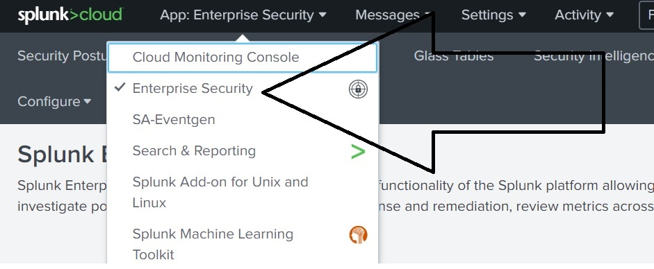

   - This will take us to the Splunk Enterprise security homepage.
   - This page has a variety of options:
      - Security Posture
      - Documentation
      - Product Tours
      - App Configuration
      - Community Page

2. For this walkthrough, we will select the **Security Posture** option in the main Splunk ES dashboard.    
 
  
  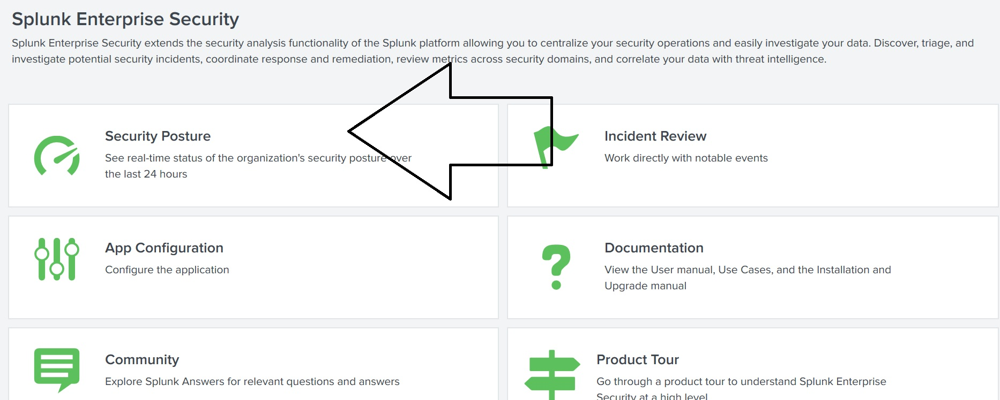

     - This page is a preconfigured dashboard featuring a variety of panels that provide the organization with insight into their security posture.

     - Just like the dashboards we configured in our previous class, organizations can edit and configure this dashboard page to suit their specific needs.

- **!!! Important Note - Splunk Enterprise Security provides real time simulated data.  They also constantly update their security event types.  The data below is just an example of one event type "network configuration changes".  Your output will vary!!**
 

     - This page illustrates Notable Security Events.

     - Notable events are events of importance for a security professional. These can be:

       - A single notable event, such as a single indicator of malware.

       - An aggregation of notable events, such as a high volume of failed logins indicating a brute force attempt.
  
   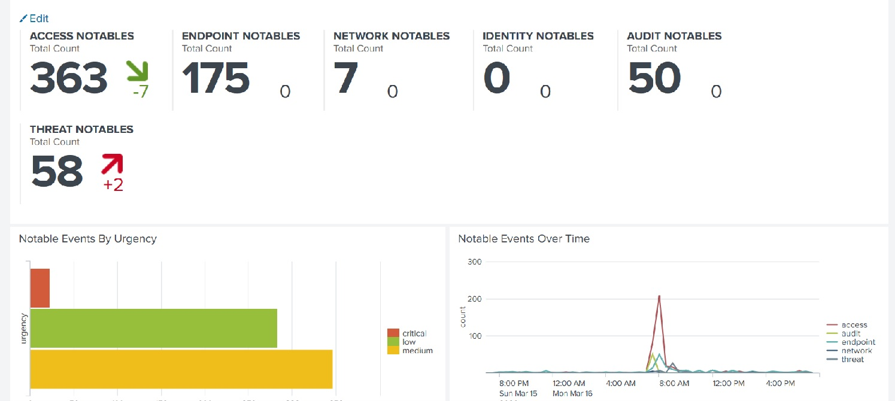

3. Now we will walk through the various panels on this dashboard:
  
    - Panel 1: Notable Event Count
      - The panel on the top of the page contains single value visualizations illustrating the count of notable events by security domain.

      - The arrow indicates whether the count is trending up or down.
        - The security domains include:
            - **Access**: Suspicious events associated with login and access.

            - **Endpoint**: Suspicious events associated with antivirus solutions installed on users' local machines.
            
            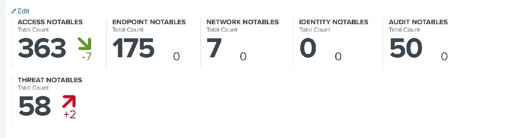                   
        
    - Panel 2: Notable Events by Urgency
      - This panel lists the count of events by urgency.

      - You can hover your mouse over one of the urgencies to see the exact count.
      
    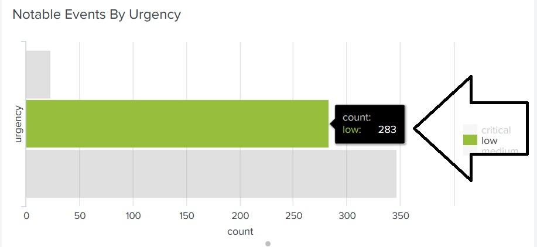
    
    - Panel 3: Notable Events by Time
      - This panel shows the count of events over time broken down by security domain.
    
    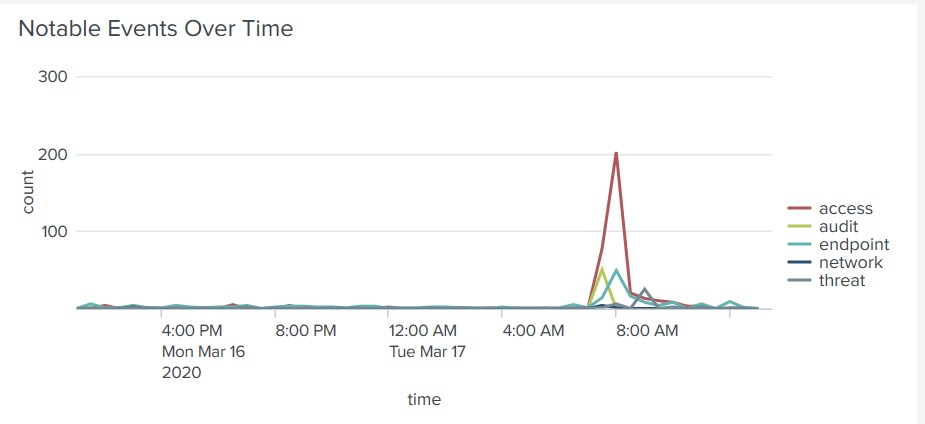
      
    - Panel 4: Top Notable Events
      - This panel shows the specific event types of the top events detected.

      - The **sparkline** is a condensed visualization that shows the count over time for an event type.
    
    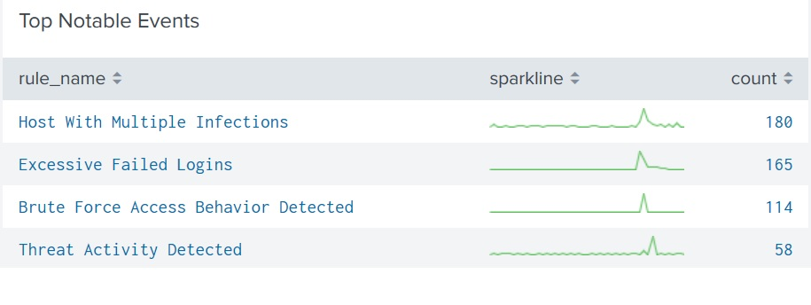
    
    - Panel 5: Top Notable Event Sources
      - This panel shows the top source IP based on notable events detected.
    
    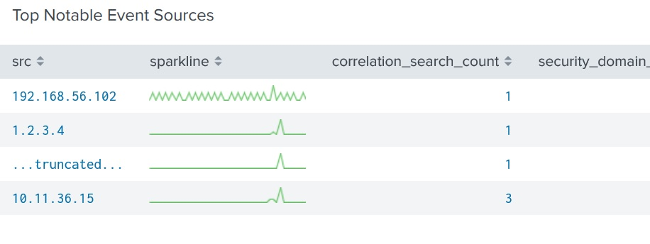

Security professionals take the data provided from Splunk ES and conduct **investigations** into the data.
  - We will now walk through how to create an investigation within Splunk ES.
  
#### Creating Splunk ES Investigations

In this scenario, we are security administrators tasked with creating an investigation into suspicious network configuration changes. 
  
1. We will start by looking at Panel 4: Top Notable Events to find the event type we want to investigate.

    - The notable event we will use to build this investigation is Network Change Detected.
    
   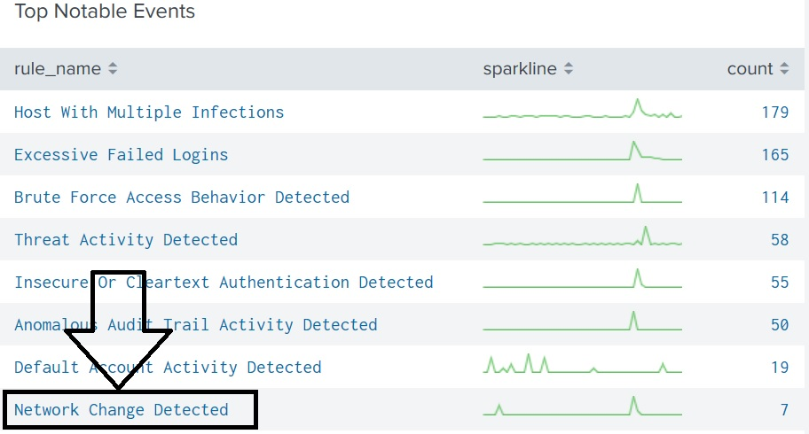    

2. Click on this event to navigate to the Incident Review page.
   
   - This page displays the individual events based on several filters.

    - Since we selected Network Change Detected, it populates that data under the **Correlation Search Name** field.
  
     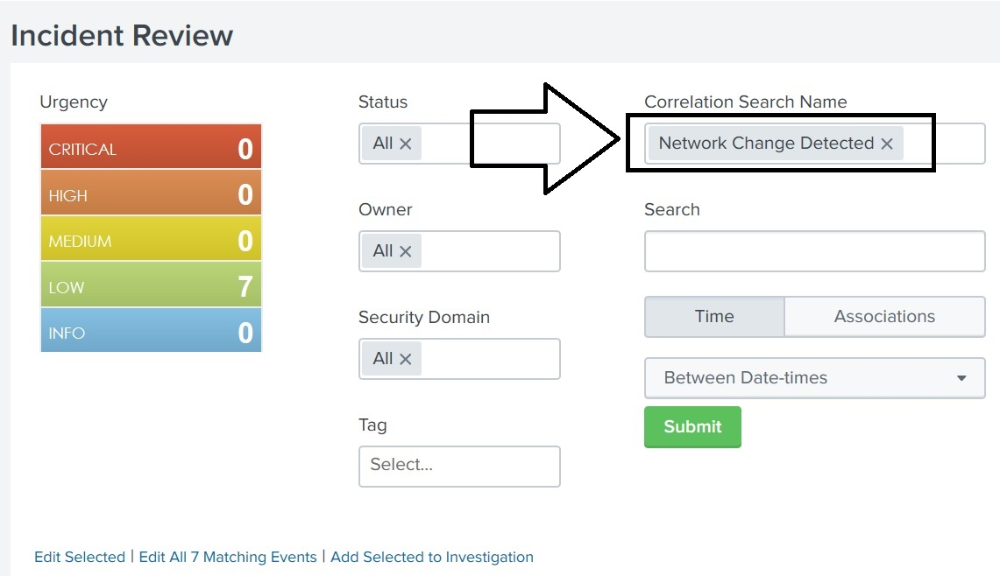    

   - You can also filter out your events by many other fields, such as:
      - Urgency
      - Owner
      - Security Domain
      - Time
      
   - The individual events from your filter will be displayed on the bottom of the page.

    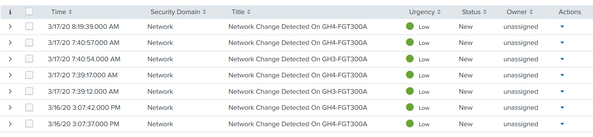  

3. For our scenario, we will add one of these events to an investigation:
   - Select the top event from your filtered list.
   - Under **Actions**, select **Add Event to Investigation**.
  
    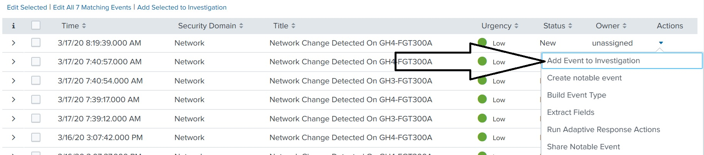  
  
   - A page will appear stating we have no existing investigations to add to.

   - To create a new investigation, select **Create Investigation**.
  
    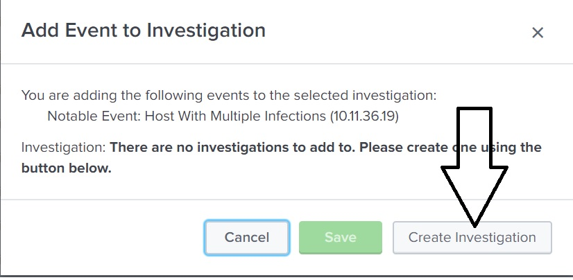  
  
4. On the next page we will create a title for our investigation: "Network Change Investigation."
    - Click **Save**.
  
    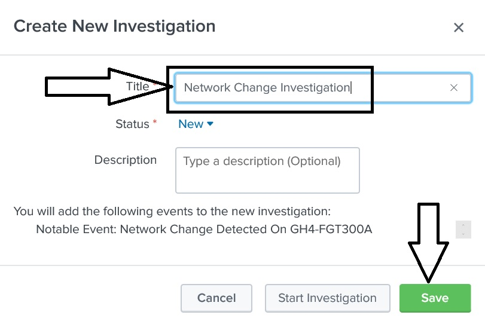  
  
    - A confirmation page prompts us to click **Add Event to Investigation**.

    - Click **Close**.
  
5. Next we will configure this notable event and assign it ownership and urgency.
    - Assigning ownership is exactly what it sounds like. In a SOC with a large staff, ownership assigns specific employees events to work on. 
   
    - To assign ownership, select place a check in the box next to the event, and select "Edit Selected"
    
      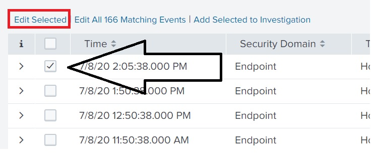  

    - Configure the following: 

      - Status: **In progress**

      - Urgency: **Medium**

         - The urgency level is judged by the individual creating the investigation, and corresponds to the severity of the particular event.
   
      -  Owner: **Splunk Cloud Admin**
         - On the job, users typically have their name as an option and will assign the event to themselves.
      
      - Comment: We can indicate additional details about what is being investigated.   
    
    - Select **Save** to update the event.  
    
   - On the Incident Review page, we can see the changes that were made to the notable event: 
 
    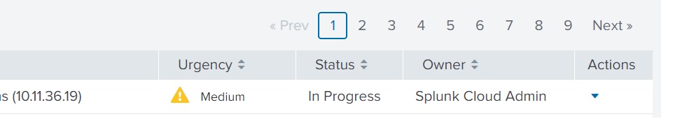 
 
6. The final item we will look at is the details of our investigation.
   - Select **Investigations** at the top of the page.
 
    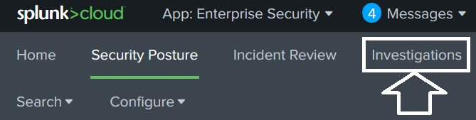 
 
    - Select **Network Change Investigation**, then **Summary**. 

     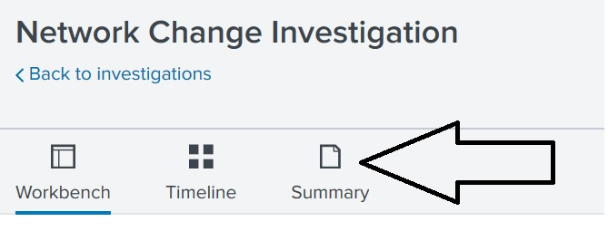
  
    - This will show the notable events you assigned to this investigation.

    - Expand the details of this event by selecting the arrow on the left.

   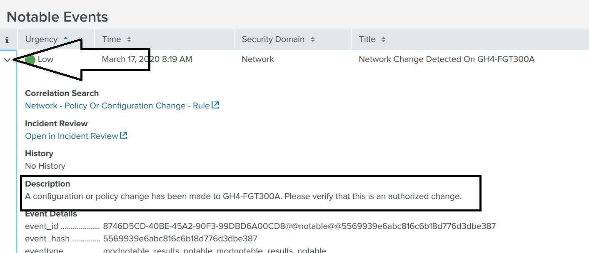

   - The description field describing the suspicious event:
      - "A configuration or policy change has been made to GH4-FGT300A. Please verify that this is an authorized change."

   - A security analyst would be tasked with determining if the configuration change was authorized and then update this investigation with their findings.

### 02. Activity: Splunk ES

- [Activity File: Splunk ES](activities/02-Splunk-ES/Unsolved/README.md)

### 03. Activity Review: Splunk ES

- [Solution Guide: Splunk ES](activities/02-Splunk-ES/Solved/README.md)

 
### 04. Introduction to Advanced Security Monitoring Tools 

While SIEM products such as Splunk ES provide many monitoring benefits, organizations are now integrating  **advanced security monitoring solutions** into their businesses to provide additional protection.
   
  - The core goal of all security monitoring solutions is to assist with detection of information security events.

  - Advanced security monitoring solutions provide additional benefits such as machine learning, artificial intelligence, automation and response.

  - The most popular advancements in the information security industry are:

    - User behavior analytics (UBA)
    - User and entity behavior analytics (UEBA)
    - Security orchestration, automation and response (SOAR) 
 

**UBA** is a security monitoring tool that  uses machine learning, artificial intelligence, and data processing to detect abnormalities in user activity.

  - UBA gathers information about typical user behaviors and creates baselines.
    - For example, UBA can gather information on the servers and systems that a user accesses as well as when and how frequently they do so. 

    - UBA can then create alerts for when a user's activity deviates from this typical behavior. 

    - If a user usually only logs onto a server between 9 a.m. and 5 p.m., Monday through Friday, UBA would create an alert if the user logged in on at 2 a.m. on a Saturday.

**UEBA** is a security monitoring tool similar to UBA, except it extends its monitoring to other "entities."
  - Entities can include routers, servers, and IoT (Internet of Things) devices.   

  - UEBA looks at normal user and entity behaviors, and creates alerts when users or entities show abnormal activity.
 
**SOAR**, comparable to a SIEM, automates security processes and responds to security incidents.
  - Examples of automating security processes include:
    - Creating logging.
    - Assigning priorities to security incidents.

  - Examples of responding to security incidents include:
    - Launching security investigations.
    - Threat mitigation.
   
  - Similar to a SIEM, SOAR gathers machine data from multiple entities and analyzes the data for security events.
    - SOAR uses **playbooks**, which detail the processes and response actions for specific event.

    - Playbooks are designed and configured by each organization.
      - For example, an organization can design a playbook to automate the response to a phishing incident.
        - The below image illustrates how SOAR uses a playbook to automate each step of the response.

        - This diagram also illustrates how using SOAR playbooks can decrease incident response time.

   
             
       

### 05. Activity: Advanced Security Monitoring Tools

- [Activity File: Advanced Security Monitoring Tools](activities/05-Advanced-Security-Monitoring/Unsolved/README.md)

### 06. Activity Review: Advanced Security Monitoring Tools Activity

### 07. Break

### 08. Splunk Careers 

Now we will examine how the Splunk knowledge and tools learned over the past five days can apply to careers and certifications in the information security industry. 

  - Even if an employer doesn't use Splunk, many Splunk skills can be easily applied to other vendors and similar products.

  - For example, if a security professional who is familiar with Splunk ES takes a position at an organization that uses LogRhythm, they should be able to note the similar core capabilities and quickly adapt to the different software. 
    

Splunk skills is a desireable qualification for many infosec positions. For example: 

  - **SOC analysts** work in a Security Operations department alongside security engineers. Their positions involve detecting, containing, and potentially remediating information security threats. Most SOC analysts use SIEM products, such as Splunk ES, to monitor their environment.
  
  - **Cyber threat analysts** analyze an organization's networks and applications to protect organizations from cybercriminals. Cyber threat analysts often use Splunk products to make predictions about cybercriminals and what attacks they may conduct.
  
  - **Application security engineers** can use Splunk to fix web and mobile application vulnerabilities. AppSec engineers use Splunk to analyze their application logs to assist with creating and testing their remediation.
  
  - **Network security administrators** use products like Splunk to monitor suspicious network traffic, such as DDOS attacks. They can use the findings from Splunk logs to mitigate and prevent against future attacks.
  
  - **Incident response managers** can use Splunk to monitor the status of ongoing security investigations when an incident has occurred.
  
Some of these positions, such as the SOC and threat analyst, may use Splunk products as part of their primary responsibilities.

  - Other security positions, such as application security administrators, may only use Splunk for a small portion of their tasks.

  - Either way, understanding how to use Splunk is a valuable skill for information security professionals.
  
Splunk is already a required skill in many roles, and the industry demand is increasing every year.
  - The following chart illustrates the growth in demand:
  
   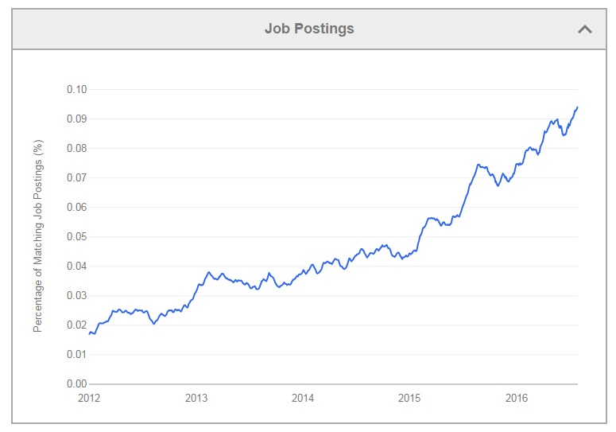
   ([Source: Edureka](<https://www.edureka.co/blog/splunk-careers-big-data-jobs/>))
  

### 09. Activity: Splunk Careers

- [Activity File: Splunk Careers](activities/09-Splunk-Careers/Unsolved/README.md)

### 10. Activity Review: Splunk Careers

### 11. SIEM Certifications

Similar to other domains in cybersecurity, Splunk skills are validated through certifications. These allow candidates to prove they have the required skills to assist an organization.

- Having a certification can help a cyber professional acquire a new position or receive a promotion, and can provide networking opportunities with professionals who have similar certifications. 

Splunk offers the following certifications:

- **Splunk Core Certified User**: Entry-level certification that demonstrates a user's basic ability to use the Splunk software.

- **Splunk Core Certified Power User**: Demonstrates a user's foundational skills with Splunk’s core software, in addition to more complex skills such as creating calculated fields and data models.

- **Splunk Core Certified Advanced Power User**: Demonstrates a user's capability to design reports, complicated searches, and dashboards.

- **Splunk Enterprise Certified Admin**: Focuses on an individual's ability to support daily administrative tasks using Splunk Enterprise software.

- **Splunk Enterprise Certified Architect**: Focuses on a Splunk administrator's role to support advanced troubleshooting, configurations, and deployments within Splunk Enterprise.

- **Splunk Enterprise Security Certified Admin**: Focuses on a Splunk administrator's role to support installation, advanced troubleshooting, configurations, and deployments with Splunk Enterprise Security environment.
  
**Note:** If you're interested in learning more about the tracks and certifications Splunk offers, visit  [Splunk: Training](https://www.splunk.com/en_us/training.html).

Like many certifications in the infosec field, most of these certifications are expensive. Many of them cost over $2,000.
 
- Fortunately, Splunk offers the first certification class, **Splunk Fundamentals 1** for free. There is only an exam fee of approximately $100.

### 12. Activity: Splunk Certification

- [Activity File: Splunk Certification](activities/12-Splunk-Certifications/Unsolved/README.md)

### 13. Activity Review: Splunk Certification

Complete the remaining modules on your own time. 
 
Explore the following resources to learn more about the certification exam:
  - [Splunk: Journey to Getting Certified](https://www.youtube.com/watch?v=-faNAbfUPFE&feature=emb_logo)  (video)
  - [Splunk: Exam Registration Tutorial](https://www.splunk.com/pdfs/training/Exam-Registration-Tutorial.pdf)
  - [PearsonVUE: Splunk Exam Registration](https://home.pearsonvue.com/splunk)
  - [Splunk: Certification Study Guide](https://www.splunk.com/pdfs/training/Splunk-Certification-Exams-Study-Guide.pdf)

    
-------

© 2020 Trilogy Education Services, a 2U, Inc. brand. All Rights Reserved.  
